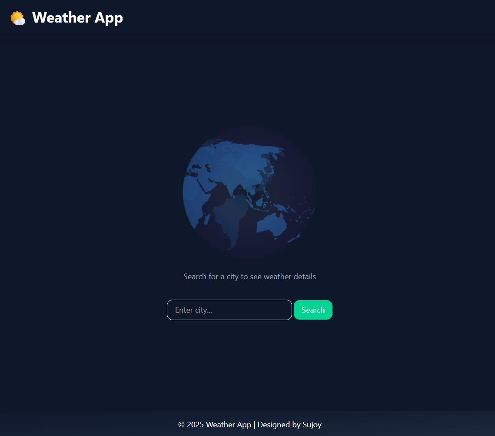
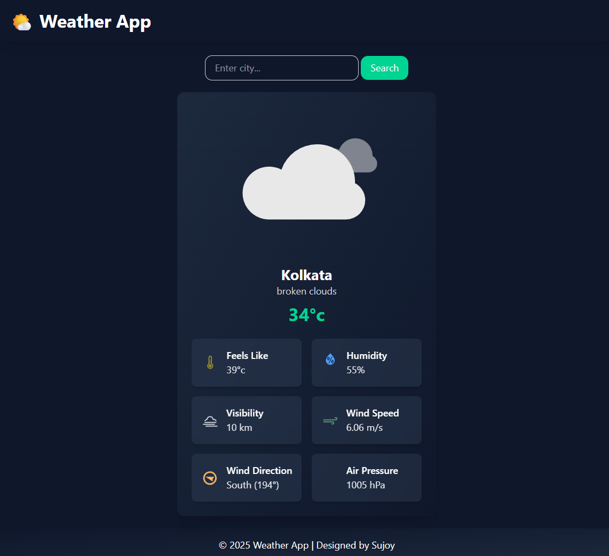

# Weather App

A simple React weather application that allows users to search for a city and view detailed current weather information with beautiful animations and icons.

---

## Features

- Search for any city worldwide.
- Displays current weather details including temperature, feels like, humidity, visibility, wind speed & direction, and air pressure.
- Animated weather icons powered by Lottie.
- Responsive design with Tailwind CSS.
- Clean UI with gradient backgrounds and smooth transitions.
- Clear empty state message displayed above the search bar when no data is loaded.

---

## Screenshots



---

## Technologies Used

- React
- Tailwind CSS
- Lottie for animations
- React Weather Icons (`react-icons/wi`)
- OpenWeatherMap API or any other weather API

---

## Setup & Installation

1. **Clone the repo**

   ```bash
   git clone https://github.com/your-username/weather-app.git
   cd weather-app
   imp install
   add api keys in .env
   npm run dev

